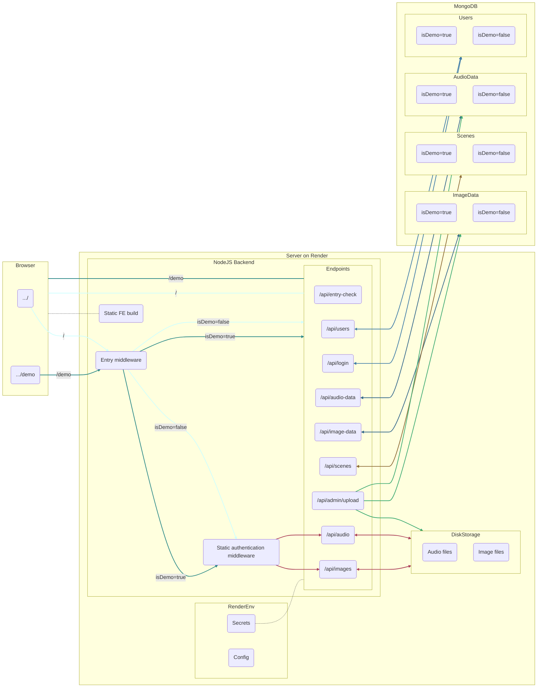

# Wedding Web App Project

View the browser demo at https://herrala-bricker-wedding.onrender.com/demo/

A mobile version will be available soon.

>[!NOTE]
> The entry key for the demo is `porkkalaGala`. If you'd like to demo admin features, feel free to contact me for demo admin credentials.

## About

I made this web app so that friends and family could listen to music and view/download pictures from my summer 2023 wedding. The demo version, I'm sorry to say, has neither wedding music nor wedding pictures; instead you'll see pictures of trees alongside music inspired by trees. 

This was also my project for the University of Helsinki's fullstack web development course (https://fullstackopen.com/). The information contained in this ReadMe is largely reflective of that.

The Basics
- Frontend: React
- Backend: NodeJS
- Mobile App: React Native (+ Expo)
- Database: MongoDB

## Frontend

## Backend

### Default vs. Demo Routing

>[!IMPORTANT]
>In this project, "default" denotes any item (e.g., entry key, token, secret, metadatum, media file, etc.) that is only available through the main `/` path. "Default" is synonomous with "non-demo", with "demo" and "default" taken to be exclusive.
>
>For example, an endpoint, in this sense, won't be "default," since the same routes handle traffic from both `/` and `/demo`. However, the requests sent to these endpoints, and the responses returned by them, will be either "default" or "demo," since both vary systematically based on referer.

The demo version of the app is structurally identical to the default version. While actual wedding content is unavailable when demoing, `/` and `/demo` return the same frontend build to the browser, and the same mobile app (with all the same components) handles both default and demo use. Additionally, default and demo requests are handled using the same routes and authenticated using the same middleware; default and demo media files are stored in the same directories on the server; and default and demo data are stored in the same collections in the same MongoDB database. This approach allows the demo view to match the default as closely as possible, all while requiring minimal extra code. The alternative, creating seperate frontend builds and/or seperate backend routes, would have been cumbersome to implement and a burden to maintain.

To accomplish this minimal default-demo strategy, default and demo requests are differentiated based on the `Referer` header. For traffic from the browser, this requires no additional steps as the default and demo pages are provided at different URLs. In the mobile app, `/demo` is added to `Referer` when the app is put into "demo mode." Entry middleware on the server then sorts requests into default and demo, assigning the property `isDemo=true` for requests that include `/demo` in the `Referer` header, and `isDemo=false` for all other requests. As every entry in the database has the attribute `isDemo`, queries to the database then select for either only default or demo data. Admin requests that add new entries to the database will assign `isDemo` based on whether the user is authenticated as a default or demo admin.

### Authentication

This project uses the jsonwebtoken package to authenticate requests using bearer tokens. 

Three levels of authentication are currently supported.
1. Entry authentication: When users provide a valid entry key, the server returns an **entry token.** This authenticates GET requests for audio and image files, scenes, and audio and image metadata.
2. User authentication: When a user logs in with a valid password, the server returns a **user token**. This is not presently used to authenticate any requests, but has been built into the architecture of the site to allow for possible expansion to user-specific views or operations.
3. Admin authentication: When an admin user logs in with a valid password, the server returns an **admin token** in addition to a user token. This admin token authenticates requests to create and delete scenes, upload and delete media, as well as link/unlink images with scenes.

>[!NOTE]
>Default and demo tokens are signed using different secrets, and cannot be used to authenticate the other's requests. A demo entry token, for example, cannot be used to authenticate a request for default image metadata.

### API

### Static Media Files

## Database

## Mobile App

## Testing

### Backend Integration Testing

### End-to-end Testing

## CI/CD

## Production Schematic

