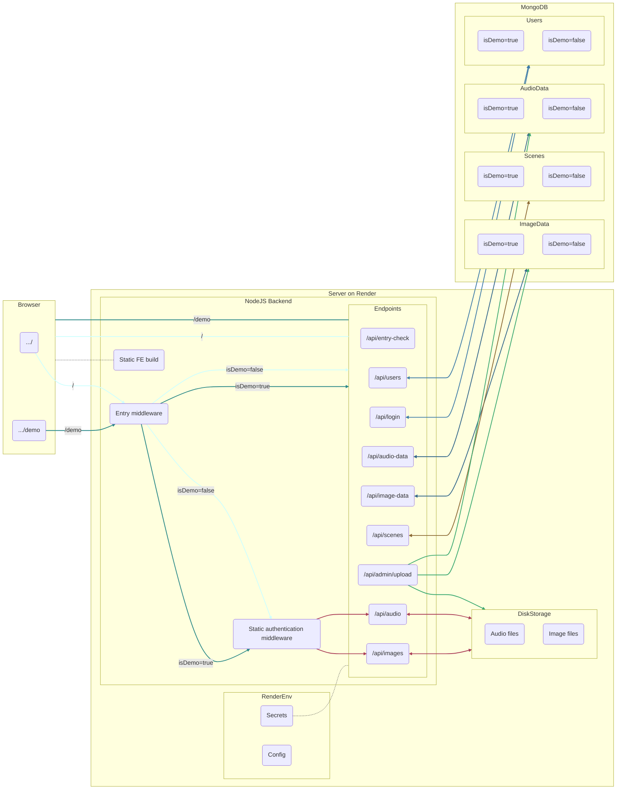

# Wedding Web App Project

View the browser demo: https://herrala-bricker-wedding.onrender.com/demo/

Download the Android app: https://play.google.com/apps/internaltest/4701371988909939863

>[!IMPORTANT]
> The entry key for the demo is `porkkalaGala`.
>
>Demoing admin features requires demo admin credentials, and downloading the app requires being added to the tester list. Feel free to contact me for either!

## About

I made this web app so that friends and family could listen to music and view/download pictures from my summer 2023 wedding. The demo version, I'm sorry to say, has neither wedding music nor wedding pictures; instead you'll see pictures of trees alongside music inspired by trees.

>[!NOTE]
>The photo credits you see on the demo page are for wedding photos; our wedding photographer did not take the pictures of trees.

This was also my project for the University of Helsinki's fullstack web development course (https://fullstackopen.com/). The information contained in this ReadMe is largely reflective of that.

### The Basics
- Frontend: React
- Backend: NodeJS
- Mobile App: React Native (+ Expo)
- Database: MongoDB Atlas

## Frontend

### Entry Page
First-time users are directed to an entry page, where they input an entry key to access the application. When a valid entry key is entered, the backend returns an entry token and users are directed to the main application. The entry token is retained in local storage until the user exits the application, and is used to authenticate data and media requests (see below).

### Main Application
The main application displays embedded audio files and a grid view of images. A loading bar reports the progress of image loading, hiding resolution and scene selection menus until every image is loaded. (Note: Since the demo version only has a few images, it's likely this progress bar won't be noticeable.) For a better user experience, every image loads into the application at the start (as opposed to lazy loading).

### Language Selection
Users can toggle between Finnish and (American) English language content by clicking the flag icons in the top left corner of the application. All bilingual text is stored in a shared [JavaScript object](frontend/src/resources/dictionary.js), facilitating efficient language switching and the easy addition of new bilingual text.

### Log-in, Log-out, and Exiting the App
Users can view an off-canvas log-in form by clicking 'kirjadu sisään/log in.' Logging in is not required for ordinary users of the site, but is necessary for admin authentication. User credentials are retained in local storage.

Clicking 'kirjadu ulos/log out' logs the user out and removes their credentials from local storage, but keeps the application open.

Clicking 'ulos/exit' removes all stored data (entry + user tokens) and closes the app, returning to the entry page.

### Image Resolution Selection
Two versions of each image are stored on the server, a web-resolution file and a full-resolution file. While the grid view will always display the web-res file, users can choose whether the highlight view (see below) displays the web-res or full-res file through the 'resoluutio/resolution' sub-menu above the image grid. This selection also determines the resolution of image downloads.

### Image Scene Selection
Admins assign images to different 'scenes' based on their content, which users can use to filter images using the 'suodata/filter' sub-menu. Example scenes include: 'kaikki/all', 'meidän suosikkimme/our favorites', and 'ryhmäkuvat/group pictures.'

### Image Highlight View
Clicking on any image in the grid takes the user to highlight view, with a single image filling the screen. Users can then scroll through images using the arrow buttons at the bottom of the screen or the left and right arrow keys. Users can also download images from highlight view by using the 'lataa/download' button.

>[!NOTE]
>One key feature of the application is the preservation of the user's view when switching to/from an image highlight. In highlight view, users will cycle through only those images included in the currently loaded scene, and they will return to the same scene when exiting highlight view.
>
>Additionally, the user's vertical scroll position in the image grid is retained when exiting highlight view, returning them to the same place they were before entering highlight view (as opposed to sending them back to the top of the grid). This produces a much nicer user experience.
>
>As it includes far fewer images, scroll retention may not be noticeable in the demo (unless the viewport is made short enough to enable scrolling).

### Admin Features
When logged in as an admin, users have a number of additional features available to them.

- File Upload: Admin users can upload audio and image files to the page. All images are linked to the 'kaikki/all' scene by default. (Note: All web-res image files are already on the server, and frontend upload only supports full-res files, with only those files with web-res counterparts being uploadable. See API Guide for more.)
- File Deletion: Admin users can delete audio and image files by clicking on a [-] button that appears next to every one. (Note: Again, this doesn't remove web-res images from the server.)
- Scene Creation and Deletion: Admin users can create and delete scenes directly from the 'suodata/filter' sub-menu. Scene codes are generated dynamically by the frontend, with scene mappings in the Finnish/English dictionary controlling the displayed scene names.
- Scene Linking: Admin users will see buttons for each scene displayed below every image, making it easy to quickly link and unlink images and scenes.
- Setting Images as 'Hidden:' One cool feature of the application is that admin users can hide an image from non-admin users simply by unlinking it from the 'kaikki/all' scene. To admins, the image will appear translucent but otherwise be visible, but it won't be loaded into the app when accessed by non-admins.

### Responsive Design
While the dedicated Android app is recommended when using a mobile device, the browser version is responsive enough to be useable with a mobile browser.

### Styling
This project uses React Bootstrap styling and prebuilt components (i.e., the main menu bar and off-canvas login) in conjunction with native styling (e.g., sub-menu buttons).

### State Management and Routing
All but the most ephemeral application states (e.g., form entries) are managed using React Redux, which is great.

React Router is used for routing main and highlight views.

## Backend

### Default vs. Demo Routing

>[!IMPORTANT]
>In this project, "default" denotes any item (e.g., entry key, token, secret, metadatum, media file, etc.) that is only available through the main `/` path. "Default" is synonymous with "non-demo", with "demo" and "default" taken to be exclusive.
>
>For example, an endpoint, in this sense, won't be "default," since the same routes handle traffic from both `/` and `/demo`. However, the requests sent to these endpoints, and the responses returned by them, will be either "default" or "demo," since both vary systematically based on referrer.

The demo version of the app is structurally identical to the default version. While actual wedding content is unavailable when demoing, `/` and `/demo` return the same frontend build to the browser, and the same mobile app (with all the same components) handles both default and demo use. Additionally, default and demo requests are handled using the same routes and authenticated using the same middleware; default and demo media files are stored in the same directories on the server; and default and demo data are stored in the same collections in the same MongoDB database. This approach allows the demo view to match the default as closely as possible, all while requiring minimal extra code. The alternative, creating separate frontend builds and/or separate backend routes, would have been cumbersome to implement and a burden to maintain.

To accomplish this minimal default-demo strategy, default and demo requests are differentiated based on the `Referer` header. For traffic from the browser, this requires no additional steps as the default and demo pages are provided at different URLs. In the mobile app, `/demo` is added to `Referer` when the app is put into "demo mode." Entry middleware on the server then sorts requests into default and demo, assigning the property `isDemo=true` for requests that include `/demo` in the `Referer` header, and `isDemo=false` for all other requests. As every entry in the database has the attribute `isDemo`, queries to the database then select for either only default or demo data. Admin requests that add new entries to the database will assign `isDemo` based on whether the user is authenticated as a default or demo admin.

### Authentication

This project uses the jsonwebtoken package to authenticate requests using bearer tokens. 

Three levels of authentication are currently supported.
1. Entry authentication: When users provide a valid entry key, the server returns an **entry token.** This authenticates GET requests for audio and image files, scenes, and audio and image metadata. No audio, image, or scene content is accessible without a valid entry token.
2. User authentication: When a user logs in with a valid password, the server returns a **user token**. This is not presently used to authenticate any requests, but has been built into the architecture of the site to allow for possible expansion to user-specific views or operations.
3. Admin authentication: When an admin user logs in with a valid password, the server returns an **admin token** in addition to a user token. This admin token authenticates requests to create and delete scenes, upload and delete media, as well as link/unlink images with scenes. No changes to site content can be made without a valid admin token.

>[!NOTE]
>Default and demo tokens are signed using different secrets, and cannot be used to authenticate the other's requests. A demo entry token, for example, cannot be used to authenticate a request for default image metadata.

### Static Media Files

Requests for audio and image files are authenticated using entry tokens provided in the query:

- Audio files: `/api/audio/<fileName>?token=<entryToken>`
- Full-res image files: `/api/images/<fileName>?token=<entryToken>`
- Web-res image files: `/api/images/web-res/<fileName>?token=<entryToken>`

This approach was chosen because methods for adding an `Authorization` header to requests from browser `` and `<audio>` elements seemed needlessly complicated (although this would have been easy to implement in the mobile app).

### API

See [API Guide](./API_guide.md)

## Database

This project uses MongoDB Atlas, a cloud-based Mongo database, with the help of Mongoose for schemas and validation.

User data, scene data, and media metadata is all stored in the database, with separate 'databases' for production, development, and testing.

## Mobile App

A mobile version of the app is available for Android devices (see link above). This Android app connects to the same endpoints on Render as the browser frontend. However, it only supports non-admin, view-only functionality. While users of the mobile app can view all the same images and listen to all the same audio, anything that requires an admin token (upload, deletion, scene linking, etc.) is only possible on browser.

Mobile-specific features of the app include:
- Audio playback using React Native Track Player.
- Gesture-based navigation for highlight view:
    - Swipe left and right to move between images.
    - Swipe down to exit highlight view.
- Entry-page toggling between default and demo mode.

## Testing

### Backend Integration Testing

This project uses Jest and Supertest for running integration tests on the backend. Currently, over 100 integration tests are written to ensure that the backend behaves as expected. 

Some of the most important checks:
- Media and scene requests fail without authentication.
- Entry tokens require a valid entry key.
- Admin tokens require a valid admin account.
- Admin accounts cannot be created without a valid admin key.
- Entry tokens cannot authenticate admin requests.
- Demo tokens cannot authenticate default requests.
- Demo and default requests only return their respective content.
- With correct authentication, requests return the expected data.
- When requests fail (e.g., invalid authentication or rejected validation), they return the expected error codes.

### E2E Testing

This project uses Cypress to run 15 extensive end-to-end tests. These check core site functionality (guest user and admin) for both good and bad credentials.

## Deployment and CI/CD

The web application is deployed using Render (https://render.com).

Frontend and backend development share a single CI/CD pipeline, which uses GitHub actions to:
- Check frontend and backend linting upon opening/syncing a PR or pushing to `main`.
- Build and populate a temporary media folder for BE testing.
- Run BE integration and E2E tests upon opening/syncing a PR or pushing to `main`.
    - These tests can be skipped for PRs by including `#skipBE` or `#skipFE` in the PR description. This can speed up checks when, e.g., no changes are being made to the BE.
    - All tests will always be run when pushing to `main`.
- Deploy to production on push to `main` (if and only if all checks pass).

>[!NOTE]
>The project is configured to prevent direct pushes to main, requiring a PR in every instance.

GitHub actions are also used to:
- Perform a twice-daily health check on the server.
- Check linting for the mobile app (this can later be expanded to include deployment of updates to the Google Play Store).

## Production Schematic

## Time log
| Date | Hours | Task(s) |
| :----:|:-----| :-----|
| 24.8 | 8 | Initial setup, DB creation, BE user endpoints, image upload architecture|
| 25.8 | 8 | Upload multiple images, FE login, initial menu, upload authentication, image metadata on DB, BE image deletion|
| 26.8 | 6 | FE deletion, image render on upload, initial highlight view, FE and BE entry control, delete authorization|
| 27.8 | 2 | Bilingual text, section links in menu, entry + login error notification|
| 28.8 | 4 | Added image scene filtering, images in 'all' by default, set scene ordering, FE and BE scene deletion, bilingual scene names |
| 29.8 | 10 | Improved filtering interface, initial auto-scroll, audio on FE and BE, admin hidden image view, bug fixes |
| 30.8 | 4 | Improved auto-scroll, image sorting, FE design improvements |
| 31.8 | 4 | Stable scene selection, song name handling, audio deletion FE and BE, arrow scrolling on highlight view, visual improvements, bug fixes |
| 04.9| 4 | Production DB config, authentication upgrade, image sorting and audio rendering on upload |
| cumulative | 50 | |
| 05.9 | 7 | Media routing troubleshooting, improved visuals |
| 07.9 | 7 | Download button, setup react router, responsive components |
| 08.9 | 3 | Visual improvements (typeface, language select, buttons, audio rendering), key listener debugging |
| 10.9 | 5 | Persistent loaded scenes, loading bar, scroll debugging, updated display while loading |
| 12.9 | 4 | Web-res images and resolution selection |
| 16.10 | 10 | React Redux Refactor 1: notifications, view reducer, highlight view to react router |
| 18.10 | 10 | React Redux Refactor 2: scene reducer, media reducer, another event listener bug fix |
| 22.10 | 5 | Audio upload reducer, remove image data from scene objects, authorization to view images|
| cumulative | 101 | |
| 21.11 | 9 | CI/CD setup, BE linting and style fixes, setup BE integration tests, setup testing DB. entry access tests, FE + BE audio authorization (+ testing) |
| 22.11 | 3 | BE integration tests: media and metadata authorization, additional entry access, misc. testing improvements |
| 02.12 | 8 | BE integration tests: admin metadata, user creation, user login, timeout debugging, media uploading |
| 03.13 | 2 | BE integration tests: more uploading, deleting, misc. debugging and small improvements |
| 05.12 | 2 | FE linting + style fixing, react version config |
| 06.12 | 8 | E2E testing: cypress config, entry tests, image upload, scenes, CI/CD pipeline config; plus improved bilingual text|
| 07.12 | 8 | E2E testing: audio upload, bad login, highlight view, image ordering, temp media folder config; plus: bleedover notification fix, improved error messages, build and CI/CD debugging, healthcheck |
| 08.12 | 4 | Demo page handling: `isDemo` added to DB, demo routing, demo authentication, demo scenes, demo FE|
| 10.12 | 4 | Demo entry tests |
| 13.12 | 6 | Demo admin tests|
| cumulative | 155 | |
| 14.12 | 8 | Mobile: Config, linting, entry, menu bar, image grid, styling |
| 15.12 | 2 | Mobile: Scene filtering, entry upgrades, layout improvements |
| 20.12 | 6 | Mobile: Bilingual switching, welcome page, highlight view, autoscroll, image component refactor |
| 21.12 | 6 | Audio player, highlight swiping |
| total | 177 | |

