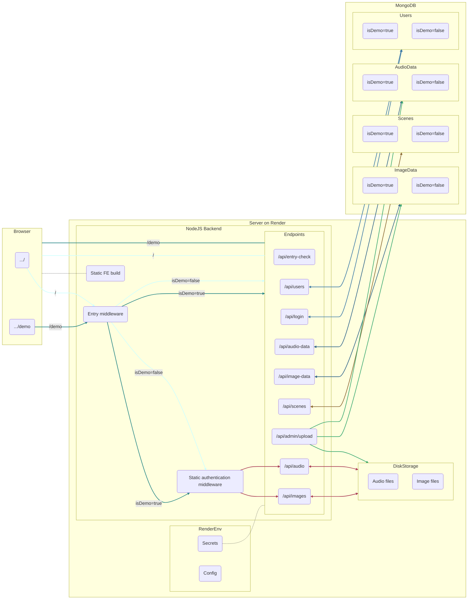

# Wedding Web App Project

View the browser demo at https://herrala-bricker-wedding.onrender.com/demo/

A mobile version will be available soon.

>[!NOTE]
> The entry key for the demo is `porkkalaGala`. If you'd like to demo admin features, feel free to contact me for demo admin credentials.

## About

I made this web app so that friends and family could listen to music and view/download pictures from my summer 2023 wedding. The demo version, I'm sorry to say, has neither wedding music nor wedding pictures; instead you'll see pictures of trees alongside music inspired by trees. 

This was also my project for the University of Helsinki's fullstack web development course (https://fullstackopen.com/). The information contained in this ReadMe is largely reflective of that.

### The Basics
- Frontend: React
- Backend: NodeJS
- Mobile App: React Native (+ Expo)
- Database: MongoDB

## Frontend

### Entry Page
First-time users are directed to an entry page, where they input an entry key to access the application. When a valid entry key is entered, the backend returns an entry token and users are directed to the main application. The entry token is retained in local storage until the user exits the application and is used to authenticate data and media requests (see below).

### Main Application
The main application displays embedded audio files and a grid view of images. A loading bar reports the progress of image loading, hiding resolution and scene selection menus until every image is loaded. (Note: Since the demo version only has a few images, it's likely this progress bar won't be noticable.) For a better user experience, every image loads into the application at the start (as opposed to lazy loading).

### Language Selection
Users can toggle between Finnish and (American) English language content by clicking the flag icons in the top left corner of the application. All bilingual text is stored in a shared [JavaScript object](frontend/src/resources/dictionary.js), facilitating efficient language switching and the easy addition of new bilingual text.

### Log-in, Log-out, and Exiting the App
Users can view an off-canvas log-in form by clicking 'kirjadu sisään/log in.' Logging in is not required for ordinary users of the site, but is necessary for admin authentication. User credentials are retained in local storage.

Clicking 'kirjadu ulos/log out' logs the user out and removes their credentials from local storage, but keeps the application open.

Clicking 'ulos/exit' removes all stored data (entry + user tokens) and closes the app, returning to the entry page.

### Image Resolution Selection
Two versions of each image are stored on the server, a web-resolution file and a full-resolution file. While the grid view will always display the web-res file, users can choose whether the highlight view (see below) displays the web-res or full-res file through the 'resoluutio/resolution' sub-menu above the image grid. This selection also determines the resolution of image downloads.

### Image Scene Selection
Images are assigned to different 'scenes' based on their content, which users can use to filter images using the 'suodata/filter' sub-menu. Example scenes include: 'kaikki/all', 'meidän suosikkimme/our favorites', and 'ryhmäkuvat/group pictures.'

### Image Highlight View
Clicking on any image in the grid takes the user to highlight view, with a single image filling the screen. Users can then scroll through images using the arrow buttons at the bottom of the screen or the left and right arrow keys. Users can also download images from highlight view by using the 'lataa/download' button.

>[!NOTE]
>One key feature of the application is the preservation of the user's view when switching to/from an image highlight. In highlight view, users will cycle through only those images included in the currently loaded scene, and they will return to the same scene when exiting highlight view.
>
>Additionally, the user's vertical scroll value in the image grid is retained when exiting highlight view, returning them to the same place they were before entering highlight view (as opposed to sending them back to the top of the grid). This produces a much nicer user experience.
>
>Unfortunately, scroll retention won't be noticable in the demo, since there are too few images to enable scrolling.

### Admin Features
When logged in as an admin, users have a number of additional features available to them.

- File Upload: Admin users can upload audio and image files to the page. All images are linked to the 'kaikki/all' scene by default. (Note: All web-res image files are already on the server, and frontend upload only supports full-res files, with only those files with web-res counterparts being uploadable. See API Guide for more.)
- File Deletion: Admin users can delete audio and image files by clicking on a [-] button that appears next to every one. (Note: Again, this doesn't remove web-res images from the server.)
- Scene Creation and Deletion: Admin users can create and delete scenes directly from the 'suodata/filter' sub-menu. Scene codes are generated dynamically by the frontend, with scene mappings in the Finnish/English dictionary controlling the displayed scene names.
- Scene Linking: Admin users will see buttons for each scene displayed below every image, making it easy to quickly link and unlink images and scenes.
- Setting Images as 'Hidden:' One cool feature of the application is that admin users can hide an image from non-admin users simply by unlinking it from the 'kaikki/all' scene. To admins, the image will appear translucent but otherwise be visible, but it won't be loaded into the app when accessed by non-admins.

### Styling
This project uses React Bootstrap styling and prebuilt components (i.e., the main menu bar and off-canvas login) in conjunction with native styling (e.g., sub-menu buttons).

### State Management and Routing
All but the most ephemeral application states (e.g., form entries) are managed using React Redux, which is great.

React Router is used for routing main and highlight views.

## Backend

### Default vs. Demo Routing

>[!IMPORTANT]
>In this project, "default" denotes any item (e.g., entry key, token, secret, metadatum, media file, etc.) that is only available through the main `/` path. "Default" is synonomous with "non-demo", with "demo" and "default" taken to be exclusive.
>
>For example, an endpoint, in this sense, won't be "default," since the same routes handle traffic from both `/` and `/demo`. However, the requests sent to these endpoints, and the responses returned by them, will be either "default" or "demo," since both vary systematically based on referer.

The demo version of the app is structurally identical to the default version. While actual wedding content is unavailable when demoing, `/` and `/demo` return the same frontend build to the browser, and the same mobile app (with all the same components) handles both default and demo use. Additionally, default and demo requests are handled using the same routes and authenticated using the same middleware; default and demo media files are stored in the same directories on the server; and default and demo data are stored in the same collections in the same MongoDB database. This approach allows the demo view to match the default as closely as possible, all while requiring minimal extra code. The alternative, creating seperate frontend builds and/or seperate backend routes, would have been cumbersome to implement and a burden to maintain.

To accomplish this minimal default-demo strategy, default and demo requests are differentiated based on the `Referer` header. For traffic from the browser, this requires no additional steps as the default and demo pages are provided at different URLs. In the mobile app, `/demo` is added to `Referer` when the app is put into "demo mode." Entry middleware on the server then sorts requests into default and demo, assigning the property `isDemo=true` for requests that include `/demo` in the `Referer` header, and `isDemo=false` for all other requests. As every entry in the database has the attribute `isDemo`, queries to the database then select for either only default or demo data. Admin requests that add new entries to the database will assign `isDemo` based on whether the user is authenticated as a default or demo admin.

### Authentication

This project uses the jsonwebtoken package to authenticate requests using bearer tokens. 

Three levels of authentication are currently supported.
1. Entry authentication: When users provide a valid entry key, the server returns an **entry token.** This authenticates GET requests for audio and image files, scenes, and audio and image metadata. No audio, image, or scene content is accessible without a vaild entry token.
2. User authentication: When a user logs in with a valid password, the server returns a **user token**. This is not presently used to authenticate any requests, but has been built into the architecture of the site to allow for possible expansion to user-specific views or operations.
3. Admin authentication: When an admin user logs in with a valid password, the server returns an **admin token** in addition to a user token. This admin token authenticates requests to create and delete scenes, upload and delete media, as well as link/unlink images with scenes. No changes to site content can be made without a valid admin token.

>[!NOTE]
>Default and demo tokens are signed using different secrets, and cannot be used to authenticate the other's requests. A demo entry token, for example, cannot be used to authenticate a request for default image metadata.

### Static Media Files

Requests for audio and image files are authenticated using entry tokens provided in the query:

- Audio files: `/api/audio/<fileName>?token=<entryToken>`
- Full-res image files: `/api/images/<fileName>?token=<entryToken>`
- Web-res image files: `/api/images/web-res/<fileName>?token=<entryToken>`

This approach was chosen because methods for adding an `Authorization` header to requests from browser `` and `<audio>` elements seemed needlessly complicated (although this would have been easy to implement in the mobile app).

### API

See [API Guide](./API_guide.md)

## Database

## Mobile App

## Testing

### Backend Integration Testing

### End-to-end Testing

## CI/CD

## Production Schematic

