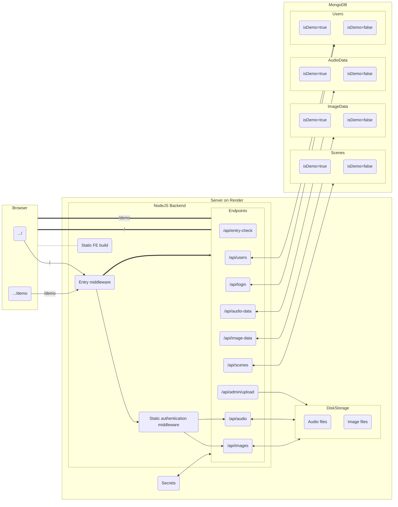

```mermaid
flowchart LR
    subgraph Browser
        A(.../)
        B(.../demo)
    end
    subgraph Server on Render
        C(Secrets)
        subgraph NodeJS Backend
            D(Static FE build)
            E(Entry middleware)
            F(Static authentication middleware)
            subgraph Endpoints
                G(/api/entry-check)
                H(/api/users)
                I(/api/login)
                J(/api/audio-data)
                K(/api/image-data)
                L(/api/scenes)
                M(/api/admin/upload)
                N(/api/images)
                O(/api/audio)
            end
        end
        subgraph DiskStorage
            AA(Audio files)
            AB(Image files)
        end
    end
    subgraph MongoDB
        subgraph AudioData
            BA(isDemo=true)
            BB(isDemo=false)
        end
        subgraph ImageData
            CA(isDemo=true)
            CB(isDemo=false)
        end
        subgraph Scenes
            DA(isDemo=true)
            DB(isDemo=false)
        end
        subgraph Users
            EA(isDemo=true)
            EB(isDemo=false)
        end
    end
    Browser -.- D
    A --> |/|E
    B --> |/demo|E
    E ==> Endpoints
    H <--> Users
    I <--> Users
    C <--> Endpoints
    J <--> AudioData
    K <--> ImageData
    L <--> Scenes
    Browser === |/|Endpoints
     Browser === |/demo|Endpoints
    E --> F
    M --> DiskStorage
    F --> N & O <--> DiskStorage
```
