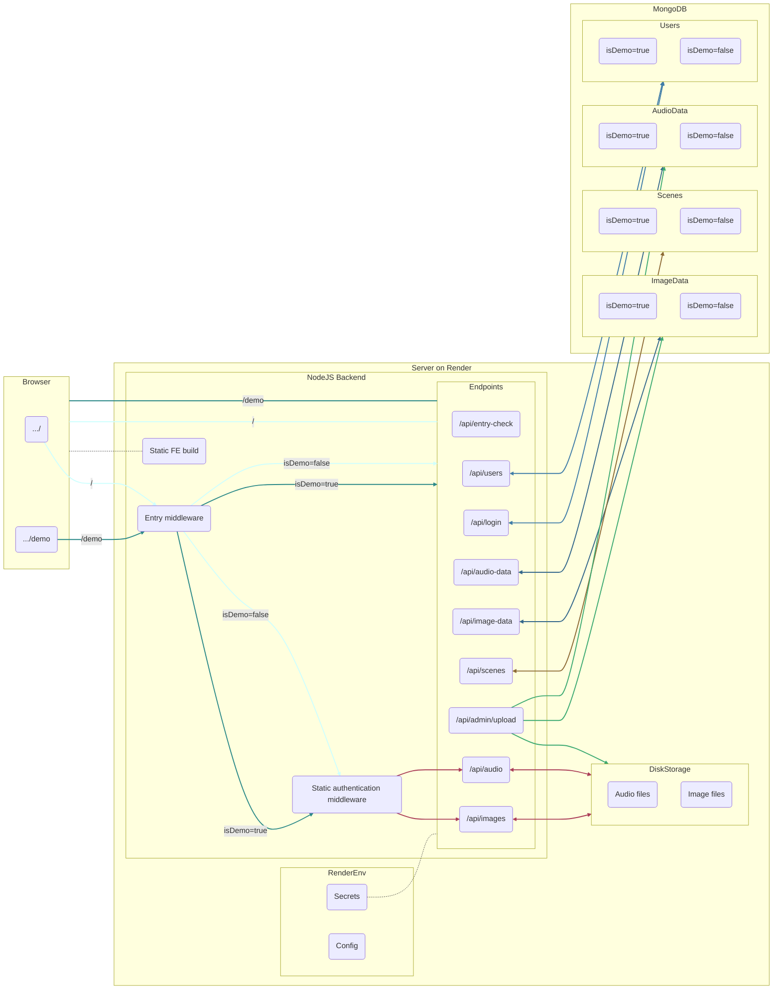

# Wedding Web App Project

View the browser demo at https://herrala-bricker-wedding.onrender.com/demo/

A mobile version will be available soon.

>[!NOTE]
> The entry key for the demo is `porkkalaGala`. If you'd like to demo admin features, please contact me.

## About

I made this web app so that friends and family could listen to music and view/download pictures from my summer 2023 wedding. The demo version, unfortunately, has neither wedding music nor wedding pictures; instead you'll see pictures of trees. 

This was also my project for the University of Helsink's fullstack web development course (https://fullstackopen.com/).

The Basics
- Frontend: React
- Backend: NodeJS
- Mobile App: React Native (+ Expo)
- Database: MongoDB

## Frontend

## Backend

### Default vs. Demo Routing

>[!IMPORTANT]
>In this project, "default" denotes any item (e.g., entry key, token, secret, metadatum, media file, etc.) that is only available through the main `/` path. "Default" is synonomous with "non-demo", with "demo" and "default" taken to be exclusive.
>
>For example, an endpoint, in this sense, won't be "default," since the same routes handle traffic from both `/` and `/demo`. However, the requests sent to these endpoints, and the responses returned by them, will be either "default" or "demo," since both vary systematically based on referer.

### Authentication

### API Routes Authenticated with an Entry Token

### API Routes Authenticated with an Admin Token

### Static Media Files

## Database

## Mobile App

## Testing

### Backend Integration Testing

### End-to-end Testing

## CI/CD

## Production Schematic

